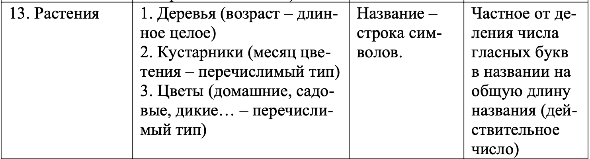

Пояснительная записка 
* Описание задания:  
  Вариант 69  
  Начальное условие задачи:  
    
  Обработка данных в контейнере:  
       

* структурная схема изучаемой архитектуры ВС с размещенной на ней разработанной программы;  
  

* Tребуемые метрики, определяющие характеристики программы, для различных тестовых прогонов.   
  Тесты с  вводом данных:

  Номер теста | Время
    ------------ | -------------
  01 | 0.233ms
  02 | 0.216ms
  03 | 0.245ms
  04 | 0.316ms
  05 | 0.412ms

  
Тесты с рандомной генерацией:

Номер теста | Время | N
------------ | ------------- | -------------
01 | 0.215ms | 1
02 | 0.237ms | 10
03 | 2.595ms | 100
04 | 228.079ms | 1000
05 | 26175.134ms | 10000
 

* Данные, демонстрирующие сравнение с характеристиками ранее разработанных программ:  
  Исходный код программы стал занимать больше места, но размер Unix Executable стал в два раза больше.
  Такая разница может быть обусловлена тем, что программа написана на с++.  
  Сравнивать время, за такое программа проходила тесты тяжело. Хоть программа в стиле ООП на с++
  и проходила большинство тестов быстрее, на последнем(с самым большим массивом входных данных), отработала быстрее процедурная версия на чистом С.
   
   
* Основные характеристики программы:   
1) Число заголовочных файлов: 6  
2) Число модулей реализации: 6 + main.c  
3) Размер Unix Executable: 59 КБ  
4) Размер исходных кодов 17,502 КБ  